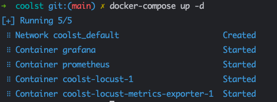
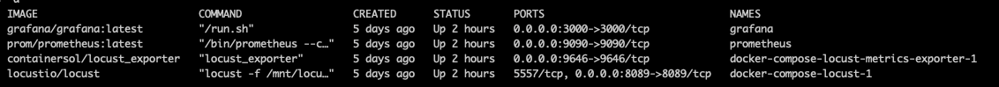
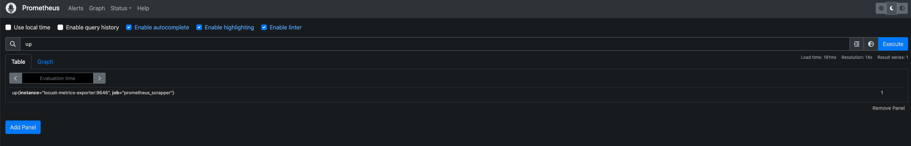
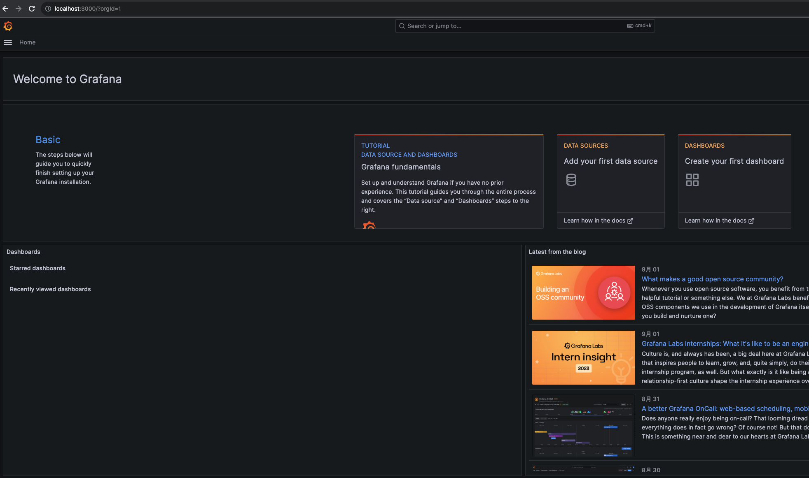
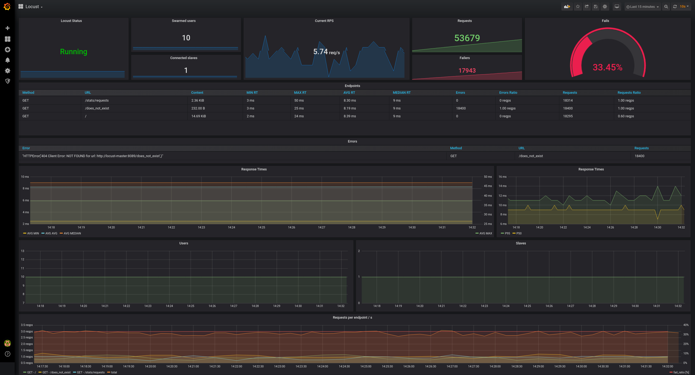

<h3 align="center">Docker部署Locust性能监控平台</h3>

## ⚡️ 特性

* Docker化部署，开箱即用
* 加入prometheus+grafana平台
* 数据持久化、监控丰富
* docker-copmse启动，简单快捷，方便扩展

## 开始使用

1. 安装好docker环境
2. ```git clone https://github.com/wohui/coolst.git```
3. 编写并替换你自己项目的locustfile.py，[官方文档](https://docs.locust.io/en/stable/)
4. ```docker-compose up -d```
   
5. 检查各个平台启动状态
   

## 各平台地址

### locust平台

[http://localhost:8089/](https://localhost:8089/)


### prometheus平台

[http://localhost:9090/](https://localhost:9090/)

[](https://)



### grafana平台

[http://localhost:3000/login](http://localhost:3000/login)



### exporter指标
[指标信息](https://github.com/ContainerSolutions/locust_exporter/blob/main/locust_exporter.md)
## 学习参考
[containersol/locust_exporter](https://github.com/ContainerSolutions/locust_exporter)

[https://github.com/locustio/locust/tree/master](https://github.com/locustio/locust/tree/master)